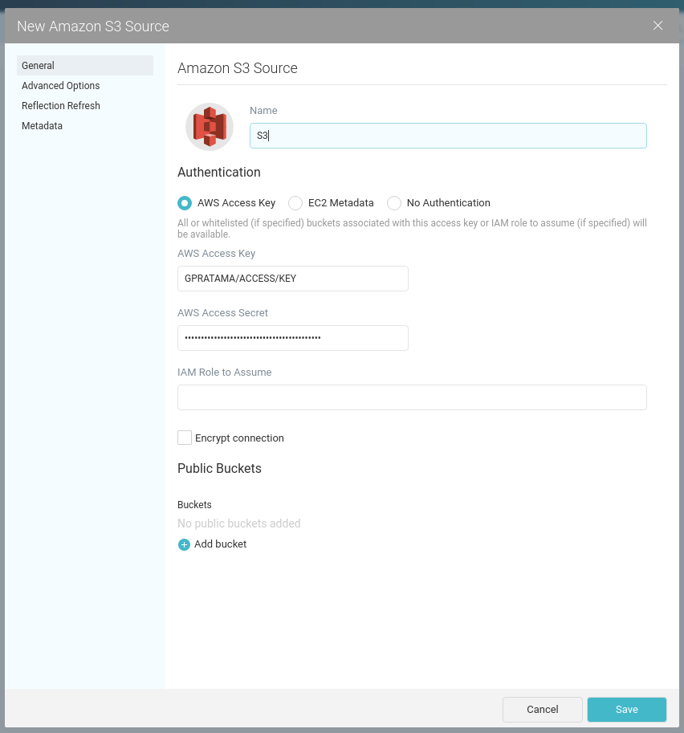
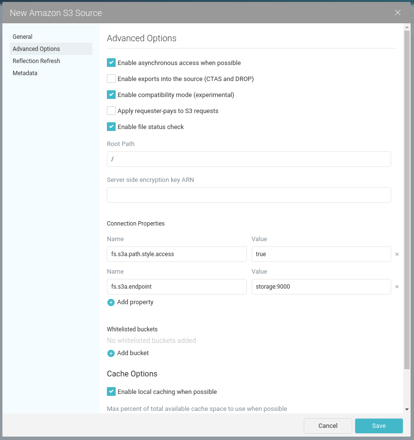

# Dremio -- Docker

## Steps

1. In General tab, set the Name, Access Key, and Access Secret.
2. In Advanced Options tab, check **Enable compatibility mode (experimental)** and add two connection properties: `fs.s3a.path.style.access` to `true` and `fs.s3a.endpoint` to `storage:9000`.

## Settings Screenshot

